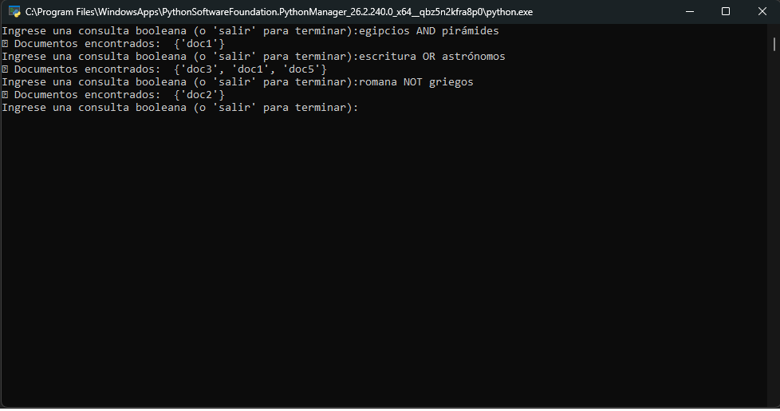

# 🏛️ Sistema de Búsqueda Booleana - Corpus Histórico

Este proyecto implementa un motor de **Recuperación de Información (IR)** basado en el **Modelo de Búsqueda Booleana** e **Índice Invertido**, aplicado a un conjunto de documentos sobre civilizaciones antiguas (egipcios, romanos, mayas, griegos y sumerios).

---

## 📌 Características principales

- **Preprocesamiento NLP con NLTK**:
  - Conversión a minúsculas (*lowercasing*).
  - Tokenización de texto mediante `word_tokenize`.
  - Remoción de palabras vacías (*stopwords*) en español.
  - Filtrado de caracteres especiales y signos de puntuación (`isalnum()`).
- **Índice Invertido**: Indexación eficiente que asocia cada término clave con el conjunto de identificadores de los documentos en los que está presente.
- **Consultas Booleanas Integradas**: Soporte para los operadores lógicos `AND`, `OR` y `NOT` utilizando operaciones algebraicas sobre conjuntos.
- **Consola Interactiva**: Bucle interactivo que permite realizar múltiples consultas secuenciales hasta ingresar el comando de salida (`salir`).

---

## 📂 Corpus de Documentos

El dataset interno contiene información sobre civilizaciones antiguas:

| ID Documento | Contenido |
| :--- | :--- |
| **`doc1`** | *"Los egipcios construyeron las pirámides y desarrollaron una escritura jeroglífica."* |
| **`doc2`** | *"La civilización romana fue una de las más influyentes en la historia occidental."* |
| **`doc3`** | *"Los mayas eran expertos astrónomos y tenían un avanzado sistema de escritura."* |
| **`doc4`** | *"La antigua Grecia sentó las bases de la democracia y la filosofía moderna."* |
| **`doc5`** | *"Los sumerios inventaron la escritura cuneiforme y fundaron las primeras ciudades."* |

---

## 🛠️ Requisitos e Instalación

### Requisitos previos

- Python 3.8 o superior.
- Biblioteca `nltk`.

### Instalación

1. Clona o descarga los archivos en tu máquina local.
2. Instala las dependencias necesarias de Python:

```bash
pip install nltk
```

3. Si es la primera vez que utilizas NLTK en tu entorno, asegúrate de descargar los paquetes necesarios descargando o descomentando en el código:

```python
import nltk
nltk.download('punkt')
nltk.download('stopwords')
```

---

## 🚀 Uso del Programa

Ejecuta el script interactivo desde la terminal:

```bash
python Consigna2_Claves.py
```

### Ejemplos de Consultas y Resultados

A continuación se detallan las consultas de prueba ejecutadas en el entorno:

| Consulta en Consola | Explicación / Lógica Booleana | Documentos Encontrados |
| :--- | :--- | :--- |
| `egipcios AND pirámides` | Busca documentos que contengan **ambos** términos. | `{'doc1'}` |
| `escritura OR astrónomos` | Busca documentos que contengan **al menos uno** de los términos. | `{'doc1', 'doc3', 'doc5'}` |
| `romana NOT griegos` | Busca documentos con `romana` **excluyendo** los que contengan `griegos`. | `{'doc2'}` |

Para cerrar el programa, simplemente escribe `salir` en la terminal.

---

## ⚙️ Arquitectura Técnica

1. **Preprocesamiento (`preprocess`)**:
   $$T \xrightarrow{\text{lower()}} T' \xrightarrow{\text{tokenize}} \{\text{tokens}\} \xrightarrow{\text{filtrado}} \{\text{palabras clave}\}$$
2. **Índice Invertido**:
   Mapeo desde el término procesado hacia el conjunto (*set*) de documentos:
   $$\text{índice}[\text{"escritura"}] = \{\text{"doc1"}, \text{"doc3"}, \text{"doc5"}\}$$
3. **Lógica Booleana de Operaciones de Conjunto**:
   - **`AND`**: Realiza una intersección de conjuntos ($A \cap B$).
   - **`OR`**: Realiza una unión de conjuntos ($A \cup B$).
   - **`NOT`**: Realiza una diferencia de conjuntos ($A \setminus B$).

---

## 📷 Captura de Pantalla

Demostración de ejecución en terminal (`Consigna2_Claves.py`):


